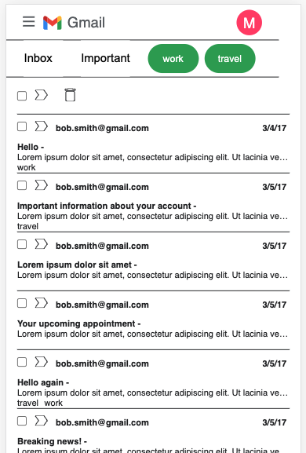
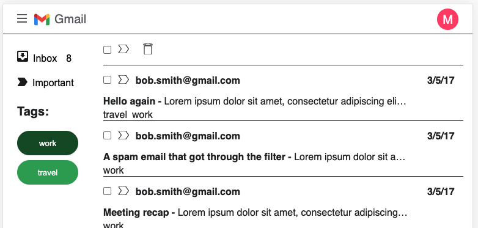
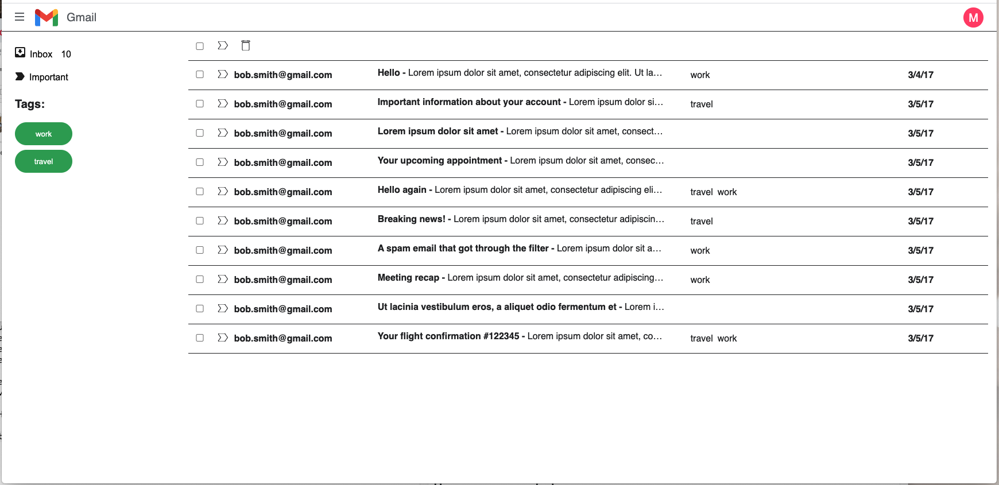

# This project
*This project is still a work in progress.*

It simulates an email service.
You can see it working on [this link](https://melskywalker.github.io/ui-exercise/public)

This project has been built with *React, Redux, React-Redux and SASS* and it is tested with *Jest and Enzyme.*

## Functionality
- Select one or more emails from the list
- Click the garbage icon to delete one or more emails
- Use Inbox button to show all the emails
- Inbox button also shows you the total number of emails you have
- Use the tag buttons *work* and *travel* from the side bar to filter the list of emails according to its tags

*Main menu, select all, mark as important and important button are not ready yet*

## Running locally
- Use `yarn` to install the dependencies needed
- Use `yarn start` to run locally. It will run on port **8080**
- Use `yarn jest -u` to run tests and update snapshots

*After running the tests you can take a closer look at the test coverage in `/coverage/lcov-report/index.html` file*

### Have an awesome day!
